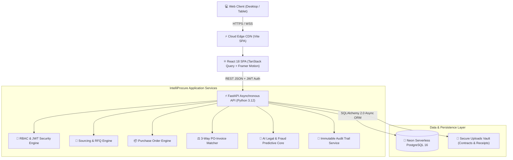
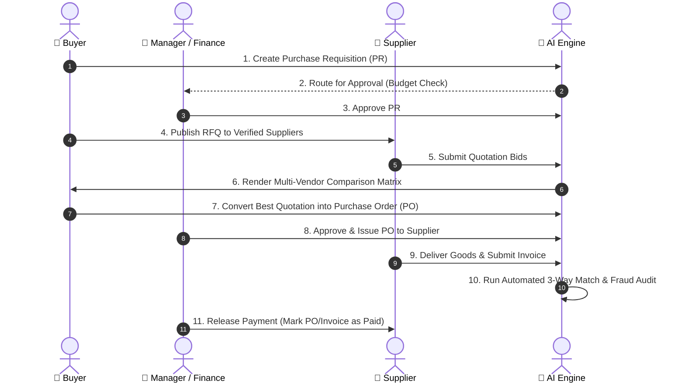
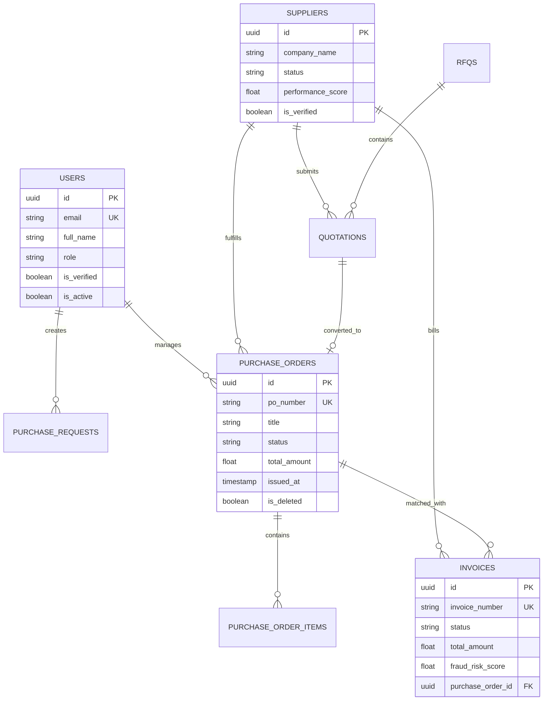

# 🚀 IntelliProcure AI — Enterprise Project Documentation & Architecture Guide

---

## 📑 Table of Contents
1. [Executive Overview & Value Proposition](#1-executive-overview--value-proposition)
2. [End-to-End System Architecture](#2-end-to-end-system-architecture)
3. [The Complete Source-to-Pay (S2P) Lifecycle](#3-the-complete-source-to-pay-s2p-lifecycle)
4. [Detailed Breakdown of Core Modules](#4-detailed-breakdown-of-core-modules)
5. [AI Engines & Machine Learning Innovations](#5-ai-engines--machine-learning-innovations)
6. [Role-Based Access Control (RBAC) & Governance Matrix](#6-role-based-access-control-rbac--governance-matrix)
7. [Database Architecture & Data Models](#7-database-architecture--data-models)
8. [Security, Auditability & Enterprise Compliance](#8-security-auditability--enterprise-compliance)
9. [Deployment, Infrastructure & Performance](#9-deployment-infrastructure--performance)

---

## 1. Executive Overview & Value Proposition

**IntelliProcure AI** is a next-generation Enterprise Source-to-Pay (S2P) and Procurement Governance platform designed to automate, de-risk, and accelerate corporate procurement workflows.

### 🎯 The Core Business Problem Solved
Traditional corporate procurement faces major friction:
- **ERP Bloat**: Legacy tools like SAP Ariba or Oracle Cloud take 12–18 months to deploy and carry six-figure licensing fees.
- **Accounting Disconnect**: Entry-level software (e.g. QuickBooks, Zoho) only records transactions *after* money is spent, failing to provide proactive spend guardrails.
- **Procurement Fraud & Invoicing Discrepancies**: Over-billing, double-invoicing, and mismatch between purchase orders, goods receipts, and vendor invoices cost enterprise companies millions annually.
- **Contract Obligation Leakage**: Legal teams lack automated tools to track penalty clauses, auto-renewal deadlines, and CPI price increase caps buried inside 50-page PDF vendor agreements.

### 💡 The IntelliProcure Solution
IntelliProcure AI provides:
1. **Automated Source-to-Pay Pipeline**: From departmental Requisition $\rightarrow$ Multi-Vendor RFQ $\rightarrow$ Quotation Matrix $\rightarrow$ Purchase Order $\rightarrow$ 3-Way Match $\rightarrow$ Payment.
2. **AI Legal Analysis**: Automated 6-clause extraction of indemnities, renewal terms, SLAs, and penalties from legal contracts.
3. **Automated 3-Way Matching Engine**: Line-item level comparison between Purchase Orders, Invoices, and Delivery Receipts with automated fraud risk scoring.
4. **Predictive Spend Analytics**: Linear trend and moving-average spend forecasting with category anomaly detection.
5. **Interactive AI Copilot**: Live database context-aware assistant capable of answering procurement queries, drafting RFQs, and analyzing vendor risks in real time.

---

## 2. End-to-End System Architecture

### 🛠️ Technology Stack

| Layer | Technologies | Key Rationale |
|---|---|---|
| **Frontend UI** | React 18, Vite, Framer Motion, Vanilla CSS Design Tokens | Blazing fast page loads, glassmorphic enterprise styling, no CSS framework overhead. |
| **State & Data Fetching** | TanStack React Query v5, Context API | Optimistic updates, background cache invalidation, live WebSocket notifications. |
| **Backend API** | Python 3.12, FastAPI, Pydantic v2, Uvicorn | Native async I/O, strict schema validation, automated OpenAPI/Swagger documentation. |
| **Database** | PostgreSQL 16 (Neon Serverless), SQLAlchemy 2.0 ORM | Relational integrity, JSONB support for AI extractions, UUIDv4 primary keys, soft-deletes. |
| **AI / Machine Learning** | Gemini 1.5 / GPT-4o-mini + Heuristic Rule Engines | High-speed contract clause extraction, invoice fraud scoring, and linear spend regression. |
| **Authentication & RBAC** | JWT (JSON Web Tokens), Bcrypt password hashing | Stateless sessions, granular role dependencies, separation of duties. |

---

## 3. The Complete Source-to-Pay (S2P) Lifecycle

---

## 4. Detailed Breakdown of Core Modules

### 1. Executive Dashboard & Metrics
- **Live Spend Aggregation**: Tracks Total Spend, Active POs, Open Invoices, Cost Savings, and Supplier Compliance.
- **Interactive Visualizations**: Spend breakdown by category (Pie/Donut), 12-month spend vs budget trends (Area chart), and quick action shortcuts.
- **Real-Time Notifications**: Instant alert dropdown for pending approvals, new quotes, and status changes with outside-click dismiss.

### 2. Supplier Lifecycle & Two-Stage KYC Gate
- **Supplier Directory**: Searchable vendor list with industry categorization, contact details, and performance tiering.
- **Two-Stage KYC Verification Gate**:
  - Unregistered or self-registered suppliers are placed into `PENDING_APPROVAL` status.
  - Until an Admin clicks **"Authorize"**, the supplier user is gated and cannot view active tenders or place quotations.
- **Vendor Scorecards**: Automated calculation of vendor health score across:
  - Timeliness ($30\%$)
  - Quality ($35\%$)
  - Price Competitiveness ($25\%$)
  - ESG & Compliance ($10\%$)

### 3. Purchase Requisitions (PR)
- Departmental purchase requests with server-side line item totaling.
- Multi-tier approval thresholds (Auto-approval under budget, Manager approval for standard amounts, Finance review for high capital spend).

### 4. RFQ & Sourcing Management
- Structured tender creation with item requirements, target quantities, and deadline countdown timers.
- Targeted vendor invitations preventing unauthorized suppliers from scraping tender pricing.

### 5. Multi-Vendor Quotation Compare Matrix
- Side-by-side bid analysis ranking suppliers on unit pricing, delivery lead times, warranty periods, and payment terms.
- **One-Click PO Conversion**: Automatically converts winning bids directly into legal Purchase Orders with zero data re-entry.

### 6. Purchase Orders (PO) Engine
- **Structured Clean Layout**: High-density table with clear column separation, generous padding, and responsive scrolling.
- **Crystal-Clear Status Progression**:
  - 🟢 **`ISSUED`**: Order is approved, binding, and active with the vendor.
  - 🔴 **`CANCELLED`**: Order has been voided/cancelled.
- **Universal Cancellation Support**: Admins and Buyers can initiate cancellation across active orders with automated audit logging.

### 7. Invoices & 3-Way Matching Engine
- Automated verification against three primary artifacts:
  $$\text{Purchase Order (PO)} \iff \text{Goods Receipt (GRN)} \iff \text{Vendor Invoice}$$
- Tolerance checking: Flags quantity discrepancies ($> 0\%$) and price variance ($> 2\%$).
- Automated Fraud Risk Indicator ($0–100\%$) based on historical supplier behavior, invoice duplicate detection, and amount bounds.

### 8. Contract Lifecycle Management (CLM) & AI Legal Engine
- Secure contract repository supporting PDF, DOCX, and scanned agreements.
- **6-Clause AI Legal Extractor**:
  1. *Payment & Invoicing Milestones*
  2. *Termination Notice & Breach Clauses*
  3. *Renewal Windows & CPI Price Caps*
  4. *Indemnification & Liability Limits*
  5. *Service Level Agreements (SLAs) & Penalties*
  6. *Confidentiality & Data Protection Standards*

### 9. Departmental Budget Controls
- Real-time departmental envelope tracking (Engineering, Marketing, Operations, IT).
- Visual progress bars showing: **Spent**, **Committed (in active POs)**, and **Available Budget**.

### 10. Predictive Spend Analytics & AI Assistant
- Machine Learning trend regression predicting quarterly spend trajectory based on historical patterns.
- **Interactive AI Copilot**:
  - Live animated reasoning pulse ($3\text{-Step DB Check}$).
  - Context-aware query answering ("Which suppliers are pending verification?", "What is our Q3 IT hardware commitment?").
  - Quick prompt chips, message copying, and keyboard shortcuts (`Ctrl+K`).

---

## 5. Role-Based Access Control (RBAC) Matrix

| Module / Action | Admin | Manager | Buyer | Finance | Auditor | Supplier |
|---|:---:|:---:|:---:|:---:|:---:|:---:|
| **Dashboard Access** | ✅ Full | ✅ Full | ✅ Full | ✅ Full | ✅ Read-Only | ✅ Supplier Portal |
| **Create Requisition (PR)** | ✅ | ✅ | ✅ | ❌ | ❌ | ❌ |
| **Approve Requisitions** | ✅ | ✅ | ❌ | ✅ | ❌ | ❌ |
| **Create / Publish RFQ** | ✅ | ✅ | ✅ | ❌ | ❌ | ❌ |
| **Submit Quotation Bids** | ❌ | ❌ | ❌ | ❌ | ❌ | ✅ (Verified Only) |
| **Create & Issue PO** | ✅ | ✅ | ✅ | ❌ | ❌ | ❌ |
| **Approve / Cancel PO** | ✅ | ✅ | ✅ | ❌ | ❌ | ❌ |
| **Approve & Pay Invoices** | ✅ | ❌ | ❌ | ✅ | ❌ | ❌ |
| **Verify / Authorize Supplier (KYC)** | ✅ | ❌ | ❌ | ❌ | ❌ | ❌ |
| **Manage Department Budgets** | ✅ | ✅ | ❌ | ✅ | ❌ | ❌ |
| **View Audit Logs & Compliance** | ✅ | ✅ | ✅ | ✅ | ✅ | ❌ |

---

## 6. Database Schema & Key Entities

---

## 7. Security, Auditability & Governance

1. **Immutable Audit Trail**:
   - Every system mutation (e.g., `PO_APPROVED`, `SUPPLIER_VERIFIED`, `PO_CANCELLED`, `PAYMENT_RELEASED`) is logged in the `audit_logs` table with user identity, timestamp, and JSON before/after state diffs.
2. **Separation of Duties (SoD)**:
   - Buyers who initiate purchase requests cannot approve payments.
   - Only Finance/Admin roles can disburse funds.
3. **Data Isolation**:
   - Supplier accounts are strictly isolated; a supplier can only access their own tenders, purchase orders, and invoices.
4. **Resilient API Design**:
   - Multi-method support (`GET`/`POST`) and trailing-slash route tolerance prevent client 405/404 errors.

---

## 8. Summary Checklist

- [x] **Frontend**: Built with React 18, Vite, TanStack Query, Framer Motion.
- [x] **Backend**: FastAPI with async route execution and Pydantic v2 schemas.
- [x] **Database**: Cloud PostgreSQL on Neon with soft-delete safety.
- [x] **Procurement Workflows**: PR $\rightarrow$ RFQ $\rightarrow$ Quote $\rightarrow$ PO $\rightarrow$ Invoice $\rightarrow$ Match $\rightarrow$ Payment.
- [x] **AI Augmentation**: Contract clause extraction, 3-way match fraud scoring, spend forecasting, and Live DB reasoning assistant.
- [x] **Deployment Status**: Continuous deployment on Render Edge and GitHub Main.
